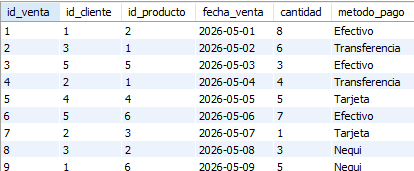
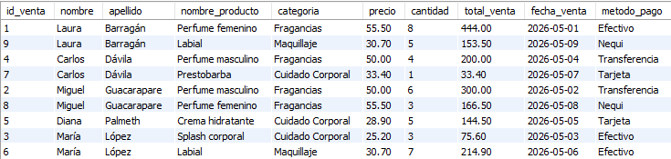

## 🗂️ Estructura de la base de datos

La base de datos se llama:

```sql
mini_retail
```

Contiene tres tablas principales:

| Tabla | Descripción |
|------|-------------|
| `clientes` | Almacena información básica de los compradores |
| `productos` | Almacena información de los productos disponibles |
| `ventas` | Registra las ventas y relaciona clientes con productos |

---

## 🔗 Modelo relacional

```text
clientes ───< ventas >─── productos

clientes.id_cliente   → ventas.id_cliente
productos.id_producto → ventas.id_producto
```

La tabla `ventas` utiliza claves foráneas para relacionar cada compra con un cliente y un producto.

---

## 📌 Conceptos SQL aplicados

| Concepto | Aplicación en el proyecto |
|---------|----------------------------|
| `CREATE DATABASE` | Creación de la base de datos `mini_retail` |
| `CREATE TABLE` | Creación de tablas relacionales |
| `PRIMARY KEY` | Identificación única de registros |
| `AUTO_INCREMENT` | Generación automática de identificadores |
| `FOREIGN KEY` | Relación entre tablas |
| `INSERT INTO` | Inserción de datos |
| `ALTER TABLE` | Adición de la columna `metodo_pago` |
| `UPDATE` + `CASE` | Actualización de métodos de pago |
| `SELECT` | Consulta de registros |
| `WHERE` | Filtros por ciudad, categoría y stock |
| `ORDER BY` | Ordenamiento por fecha |
| `DELETE` | Eliminación controlada de una venta |
| `INNER JOIN` | Relación entre ventas, clientes y productos |
| Campo calculado | Cálculo de `total_venta` |

---

## 📊 Evidencias del proyecto

### 1. Tablas creadas


### 2. Ventas con método de pago



### 3. Consulta JOIN con total de venta



---

## 📈 Resultado principal

La consulta final permite visualizar cada venta con información completa:

- ID de venta
- Nombre y apellido del cliente
- Producto comprado
- Categoría del producto
- Precio
- Cantidad
- Total de venta
- Fecha de venta
- Método de pago

Ejemplo del cálculo aplicado:

```sql
(p.precio * v.cantidad) AS total_venta
```

---

## 💼 Valor para el portafolio

Este entregable demuestra fundamentos importantes para un perfil inicial de análisis de datos:

- Comprensión de bases de datos relacionales.
- Uso de claves primarias y foráneas.
- Capacidad para consultar y relacionar datos.
- Organización de un proyecto técnico en GitHub.
- Documentación básica orientada a portafolio.

---

## 🧩 Aprendizajes

Durante este entregable se practicó la construcción de una base de datos desde cero, la inserción de datos, la modificación de una tabla existente, la actualización de registros y el uso de `JOIN` para obtener información útil a partir de varias tablas relacionadas.

---

## ✅ Estado del entregable

**Completado.**

---

<div align="center">


</div>
